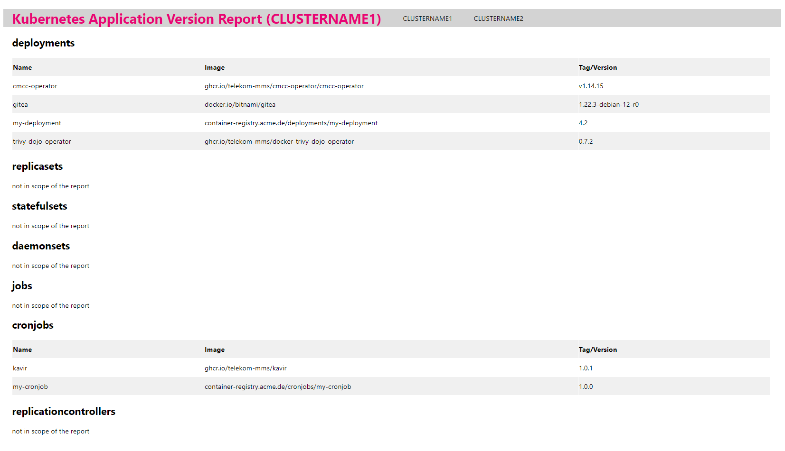

# kavir - **K**ubernetes **A**pplication **V**ers**I**on **R**eporter - html-report-builder

The html-report-builder is a python script that uses the csv files from the git repository to build a single page html report file.

## config.json

| variable     | description                                                                |
| ------------ | -------------------------------------------------------------------------- |
| reportName   | the name of the report that is displayed in the report header              |
| **paths**    |                                                                            |
| srcDir       | the path to the local version of the git repository which contains the csv files (The script does not pull the latest commits. You have to take care of this on your own.) |
| styleFile    | the path to the style file (The content of the style file is rendered into the html report. Therefore it is not needed after the html report was created.) |
| outDir       | the path to the single page html report file that is created by this script (The script does not create missing parent directories.) |
| **menu**     |                                                                            |
| enabled      | indicates whether the menu is displayed in the report header               |
| linkBasePath | the link base path that is used to build the href of the links in the menu |

## Usage

* create a project access token for the git repository which contains the csv files
  * role: Maintainer
  * scopes: read_repository
* create `config.json` from `config.json.template`
  * configure `config.json`
* run `pip3 install -r requirements.txt`
* run `python3 main.py -c config.json -n <clusterName> [-v]`
  * run `python3 main.py -h` for further information

## html report file preview

A single page html report file could look like this:

